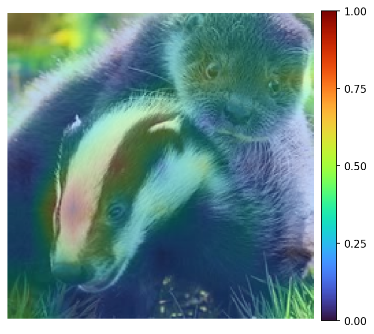
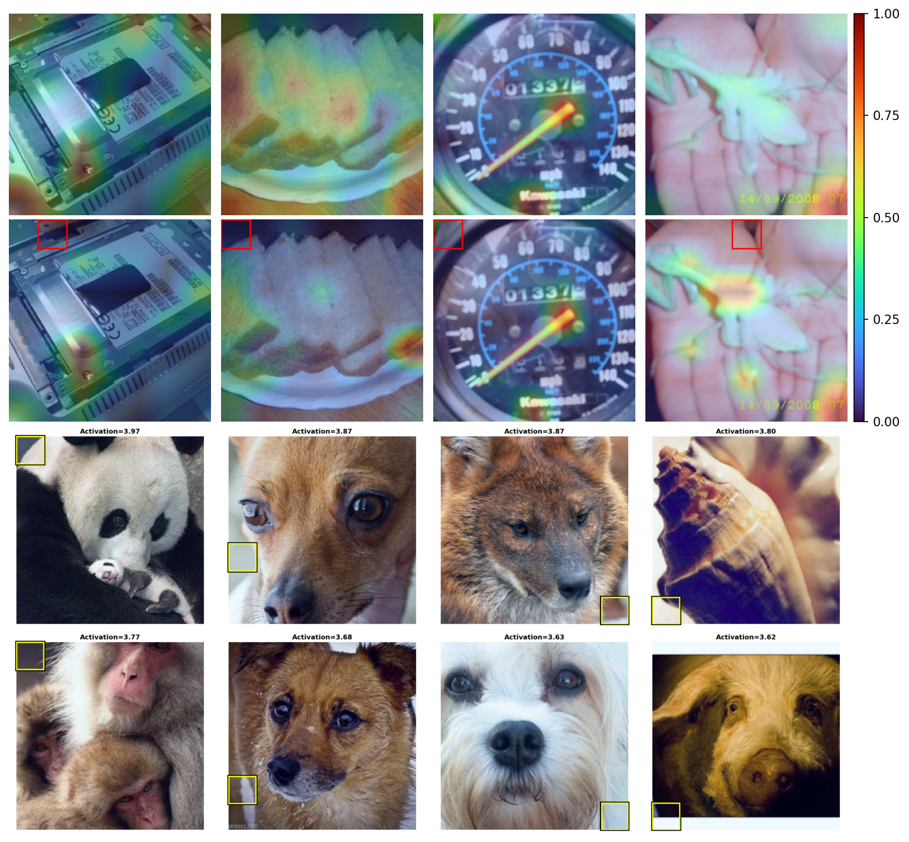
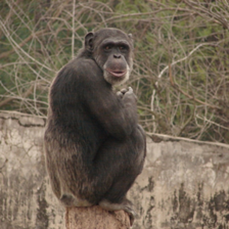
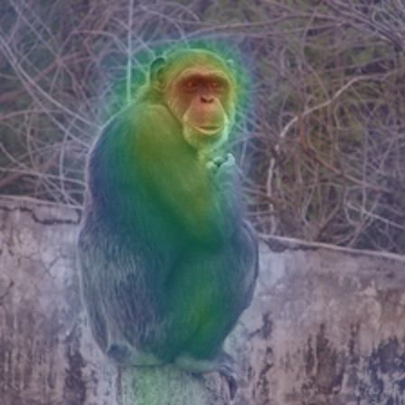
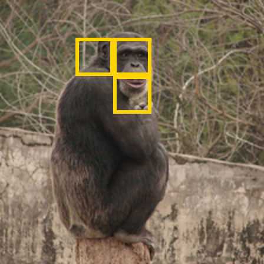
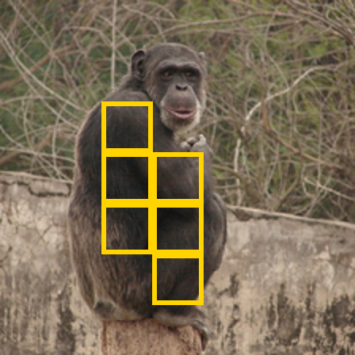
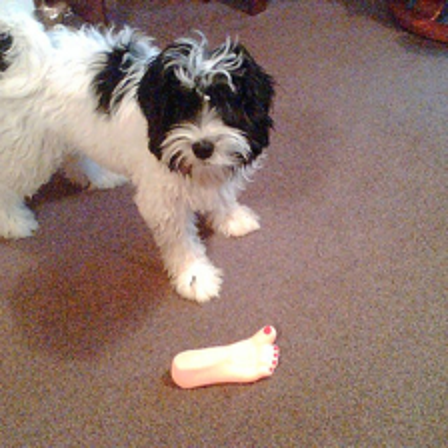
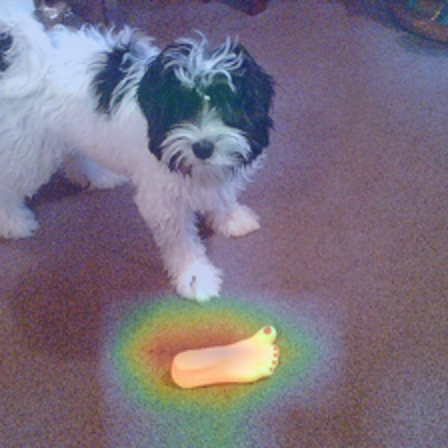
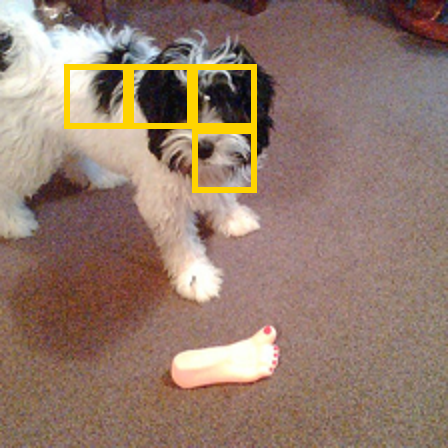
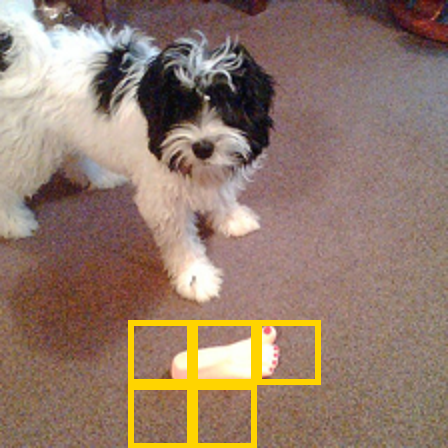

# Using JLens to Explain Vision Transformer Attributions

Explaining how an image classification came to be is an old problem. One way to go about it is to generate attribution maps, which are heatmaps highlighting areas contributing a lot (red) or very little (blue). With that, we gain an important understanding: what part of the image is important? But this leaves two important questions unanswered. What concepts does the model represent at that part of the image? And how does this part of the image contribute to the final prediction?

<figure>
  
  <figcaption>Figure 1. Vanilla TransMM attribution for the predicted class, badger, with its normalized attribution scale. From Šula et al. <a href="#ref-sula">[2]</a>.</figcaption>
</figure>

There are several methods to try to get to an answer on one of the questions; what concepts a model internally uses at different parts of an image. Logit lens, linear probes, sparse autoencoders to name a few. All of them with different advantages and disadvantages. Recently, a new method called JLens by Anthropic was published which adds one more method trying to answer that question. In this post I examine how well JLens is suited to help explain attributions from a CLIP model specifically. This uncovered a few promising directions:

- JLens scores had moderate but consistent correlation with attribution (ρ = +0.3123; positive in 88.23% of images).
- Highly attributed patches reflected their prediction in the JLens vectors; the predicted class appeared in the top 10 JLens concepts 53.24% of the time, versus 25.35% for random patches.
- Logit-lens scores were negatively correlated with attribution on the same layer representations (ρ = −0.3951).

## Attributions in Vision Transformers
Explainability has been a topic of great significance for many years already. Especially attributions in vision models are one type of explainability (or what we would call interpretability nowadays) that have been around for quite some time. When a vision model takes in an image and outputs a classification, as is the case with Vision Transformers, we would like to understand what part of the image plays a more (or less) significant role to the final decision in the classification process. Attributions are generating heatmaps, made up from attribution values, highlighting regions with more impact with a more red color (higher attribution value) compared to regions with lower impact (blue color).

Introduced by Chefer et al., TransMM is one of the methods producing these attribution images building upon a fairly simple concept which is what makes it so powerful in my opinion. Compute the gradients of the attention maps and multiply them with their activations. To get a single token by token map, average across all the heads per layer. Additively propagate the scaled attention maps. At the end, you extract the first row which has one value per token for the final classification token. This is going to be your attribution map.
[[1]](#ref-chefer)

$$
\bar{\mathbf{A}}^{(\ell)}
=
\mathbb{E}_{h}\!\left[
\left(
\frac{\partial y}{\partial \mathbf{A}_{h}^{(\ell)}}
\odot
\mathbf{A}_{h}^{(\ell)}
\right)_{+}
\right]
\tag{1}
$$

$$
\mathbf{R}^{(0)} = \mathbf{I},
\qquad
\mathbf{R}^{(\ell)}
=
\mathbf{R}^{(\ell-1)}
+
\bar{\mathbf{A}}^{(\ell)} \mathbf{R}^{(\ell-1)}
\tag{2}
$$

This works fairly well, measured under different faithfulness metrics such as SaCo, Faithfulness Correlation, and Pixel Flipping, but it leaves one of the most important questions on the table. Not only what part of the image was important, but WHY was it important? We can only make educated guesses with these methods. In my own research, I have tried to answer the question behind why through the integration of a Sparse Autoencoder (SAE). I designed a method that combines the SAE features into the attribution generation process, and found that it consistently improved SaCo and Faithfulness Correlation, while producing smaller and more mixed improvements on Pixel Flipping [[2]](#ref-sula). But there are a few limitations with this method, first is having to train a Sparse Autoencoder which takes time and compute. Another one is that the features generated by the SAE are learned in an unsupervised manner; this leaves us second guessing their semantic meaning again when features have no clear characteristics. 

<figure>
  
  <figcaption>Figure 2. Feature 29914 (layer 7) responds to low-level edge structures and color transitions across otherwise unrelated images, making a single semantic interpretation difficult. From Šula et al. <a href="#ref-sula">[2]</a>.</figcaption>
</figure>

## JLens and how it connects to vision
A spiritual continuation of the logit lens approach, the Jacobian lens (J-lens) is a method developed by Anthropic and was used in their technical report to find evidence of a global workspace [[3]](#ref-jlens). In their language-model experiments, it seems to hint at a special phenomenon where intermediate representations can not only be decoded into verbalizable concepts, but a small privileged component of these representations is also causally involved in downstream computation. I use their lens construction, but do not assume that vision models contain the same privileged sparse J-space. To understand what exactly is happening here, we need three pieces:

$$
\mathbf{J}_{\ell}
=
\mathbb{E}_{\,t,\,t' \geq t,\,x}
\left[
\frac{\partial \mathbf{h}_{L,t'}(x)}
     {\partial \mathbf{h}_{\ell,t}(x)}
\right]
\tag{3}
$$

$$
\mathbf{v}_{\ell,w}
=
\mathbf{J}_{\ell}^{\top}\mathbf{w}_{U,w},
\qquad
\mathbf{v}_{\ell,w}^{\top}
=
\left(\mathbf{W}_{U}\mathbf{J}_{\ell}\right)_{w,:}
\tag{4}
$$

$$
s_{\ell,w}\!\left(\mathbf{h}_{\ell,t}\right)
=
\left\langle
\mathbf{v}_{\ell,w},
\mathbf{h}_{\ell,t}
\right\rangle
\tag{5}
$$

This gives us a score for each internal activation that is able to describe its alignment with verbalizable concepts. Anthropic found a sparse, privileged J-space component within the activation space, while substantial representation remains outside that component. Their interventions show that selected JLens coordinates can be causally involved in downstream computation. The paper is well worth a read, but I will mostly concentrate on the JLens vector and score for the rest of the post. In this experiment, I use the signed projection in Equation 5.

One thing the JLens vector and the JLens score can tell us is internal alignment with verbalizable concepts, similar to logit lens. The logit lens applies the model's final decoder directly to an intermediate activation. JLens instead uses an average Jacobian to transport the final output directions back into the intermediate representation space. Assuming that the internal representation between layers might be different, this seems more principled (the Anthropic report talks more about that). The question then naturally formed; does this give us a more consistent explanation of why some patches are more important to the final classification, and how does it compare to other methods?
## Method
So I am using the JLens vector to calculate a score for each token inside an intermediate layer and apply those to explain attribution maps. I use an OpenCLIP ViT-B/32 model, checkpoint `CLIP-ViT-B-32-DataComp.XL-s13B-b90K`, which was contrastively pretrained on DataComp image–text pairs and is evaluated zero-shot on ImageNet-1k. At a 224×224 input resolution, its 32×32 patches produce a 7×7 grid of 49 spatial tokens. I apply the JLens vector at layer 9. This comes from the experiments here [[2]](#ref-sula), where we identified layer 9 of that model to be specifically strong for Sparse Autoencoders. This seemed like a good starting point for this evaluation.
### Calculating the JLens Vectors
In CLIP, there are a few different architectural properties than in a decoder-only LLM, for which the method was designed. Unlike an autoregressive LLM, a ViT has no ordered set of future token positions. I therefore differentiate the final normalized image embedding, derived from CLS, with respect to every layer-9 spatial token and average these Jacobians across images and patch positions. All spatial tokens interact bidirectionally, and the final image embedding is the single endpoint used by the classifier.

The next step is adapting the idea of the unembedding matrix. CLIP does not have a fixed 1,000-class unembedding matrix in the same sense as an LLM. I construct a bank of 1,000 normalized ImageNet class directions using CLIP's text encoder. For class \(c\), its normalized text direction \(\mathbf{t}_c\) plays the role of the output direction, and the class logit is \(z_c(x)=\tau\mathbf{t}_c^\top\mathbf{e}(x)\).

$$
\mathbf{J}_{\ell}^{\mathrm{ViT}}
=
\mathbb{E}_{x,p}
\left[
\frac{\partial \mathbf{e}(x)}
     {\partial \mathbf{h}_{\ell,p}(x)}
\right]
\tag{6}
$$

$$
\mathbf{v}_{\ell,c}
=
\tau
\left(\mathbf{J}_{\ell}^{\mathrm{ViT}}\right)^{\top}
\mathbf{t}_{c}
=
\mathbb{E}_{x,p}
\left[
\frac{\partial z_c(x)}
     {\partial \mathbf{h}_{\ell,p}(x)}
\right]
\tag{7}
$$

$$
s_{\ell,p,c}(x)
=
\left\langle
\mathbf{h}_{\ell,p}(x),
\mathbf{v}_{\ell,c}
\right\rangle
\tag{8}
$$

I fitted \(\mathbf{J}_9^{\mathrm{ViT}}\) on 9,993 ImageNet training images. The evaluation below used 10,000 class-balanced ImageNet validation images that were disjoint from the fit set. The frozen model's accuracy on this evaluation sample was 64.67%, but all semantic-alignment measurements use the model's own prediction as the target rather than the ground-truth class. This lets the experiment ask whether JLens explains the model's decision even when that decision is wrong.

### Case study

To see how JLens vectors extend conventional attribution maps, we can examine both a success case where JLens disambiguates competing concepts and a failure case where JLens diagnoses the likely semantic distraction that misled the model.

#### Example of Progressive Evidence

In the first example (Figure 3), the model correctly classifies the image as **chimpanzee** with moderate confidence (~0.50), with **baboon** as the runner-up.

<figure>
  

    
    
    
    
  

  <figcaption>Figure 3. Semantic decomposition of evidence for a correct <i>chimpanzee</i> prediction (runner-up: <i>baboon</i>). (Top-left) Original model input. (Top-right) Vanilla TransLRP attribution map with a turbo overlay. (Bottom-left) Head patches (9, 10, 17) where attribution concentrates (mean 0.060) and <i>chimpanzee</i> dominates (mean rank #2.3). (Bottom-right) Torso patches (16, 23, 24, 30, 31, 38) where attribution is lower (mean 0.037) and decoded semantics are ambiguous across primate classes (mean rank #8.3).</figcaption>
</figure>

Standard TransLRP attribution (top-right) indicates that while the entire animal contributes to the decision, the strongest attribution hotspot is located on the face and head. Inspecting the layer-9 JLens readouts suggests the internal reason for this split:

1. **Torso patches (bottom-right):** The dark, shaggy body fur produces semantic ambiguity across closely related primate classes. Averaged over all torso patches, the top decoded concepts are *howler monkey* (+0.363), *siamang* (+0.340), *gorilla* (+0.335), *chimpanzee* (+0.315, #4), and *baboon* (+0.311, #7). In fact, patch 24 (the chest) decodes *baboon* as #1. Across the torso, the true class achieves only a lower mean rank of #8.3.
2. **Head patches (bottom-left):** In contrast, the facial region receives ~60% stronger attribution (mean 0.060 vs 0.037) and cleanly resolves this ambiguity. Here, *chimpanzee* decisively claims rank #1 (mean rank #2.3 across head patches, with patch 10 on the face ranking *chimpanzee* #1 directly).

The JLens readouts suggest that the model's decision is not uniformly distributed: the body provides generic primate evidence that leaves *baboon* in close contention, while the facial features provide the specific evidence that tips the final prediction to *chimpanzee*.

#### Distraction in the Image

JLens is equally informative when the model fails. In Figure 4, the ground truth is **Tibetan terrier**, but the model incorrectly predicts **hotdog** (confidence ~0.86, runner-up *Tibetan terrier*).

<figure>
  

    
    
    
    
  

  <figcaption>Figure 4. Diagnosing a classification error where ground truth is <i>Tibetan terrier</i> but the model predicted <i>hotdog</i>. (Top-left) Original model input. (Top-right) TransLRP attribution map showing attribution concentrated over the toy. (Bottom-left) Dog patches (8, 9, 10, 17) where <i>Tibetan terrier</i> is correctly recognized (mean rank #1.2) but receives lower attribution (0.039). (Bottom-right) Toy patches (37, 38, 39, 44, 45) which dominate attribution (0.087) and decode as smooth, oblong fleshy/food objects (<i>hotdog</i> mean rank #9.0, aggregate #1).</figcaption>
</figure>

Conventional attribution (top-right) shows that the model shifted almost all of its focus away from the dog and onto the plastic foot-shaped dog toy on the floor (mean attribution of 0.087 on the toy vs. 0.039 on the dog). Saliency maps alone can show *that* the model looked at the toy, but they cannot explain *why* looking at a plastic foot resulted in the label *hotdog*. JLens decodes the underlying semantic representation:

1. **Dog patches (bottom-left):** The model's representation over the dog itself is largely intact. The layer-9 JLens readouts over patches 8, 9, 10, and 17 unanimously decode as fluffy dog breeds, with *Tibetan terrier* ranking #1 on three patches (mean rank #1.2, while *hotdog* is at rank #281.5).
2. **Toy patches (bottom-right):** Averaging the JLens readout across the toy region (patches 37, 38, 39, 44, 45) suggests that CLIP interpreted the smooth, pinkish, oblong shape as a cluster of fleshy, rubbery, and food-like objects: *hotdog* (+0.300, #1), *butternut squash* (+0.271, #2), *Band Aid* (+0.251, #3), *rubber eraser* (+0.232, #4), and *clog* (+0.213, #7), alongside specific footwear labels (sandal, running shoe) concentrated on the painted toenails of patch 39.

This semantic breakdown helps us understand what might have gone wrong. It seems that the model correctly recognized the dog, but the distraction by the toy produced an even stronger set of confusing activations that overwhelmed the dog's logits at the output layer. JLens helps us interpret along the way, which in turn allows us to make more informed guesses on what went wrong here.

## Results
The central comparison is summarized below. Both lenses are evaluated on the same layer-9 patch residuals and against the class predicted by the model. The correlation is calculated within each image across all 49 patches and then averaged across 10,000 images; the rank measurements use the five patches with the highest TransLRP attribution.

| Measurement | JLens | Logit lens |
|---|---:|---:|
| Mean within-image Spearman correlation with attribution | +0.3123 | −0.3951 |
| Images with positive correlation | 88.23% | 7.71% |
| Mean predicted-class rank in the five most-attributed patches (lower is better) | 104.7 | 832.6 |
| Predicted class in the top 10, averaged over those patches | 53.24% | 0.17% |

What I found is that JLens seems to be well-aligned with attribution, and therefore offers a promising way of interpreting attribution patterns. For the top 5 patches with the highest attribution value, the prediction made by the model was in the top 10 of the JLens readout 53.24% of the time, compared with 25.35% for random patches and 13.36% for the least attributed patches. Under a fixed random reassignment of class labels, the top-patch rate was only 0.87%. When aggregating the five patch readouts before ranking the classes, the corresponding rates were 81.41% for the highest-attribution group, 45.60% for random patches, and 18.93% for the lowest-attribution group.

Across all 49 patches and 10,000 validation images, the mean within-image Spearman correlation between vanilla TransLRP attribution and the predicted-class JLens score was 0.3123, with a 95% confidence interval of 0.3074–0.3172 and a median of 0.3409. The correlation was positive in 88.23% of images. Thus the relationship is moderate rather than a reconstruction of the attribution map, but it is highly consistent across images.

At layer 9, there is also evidence that both local and global information plays a role. Adjacent patches had 16.3% exact top-concept agreement and mean readout-vector cosine 0.305. Far-apart patches had 4.9% agreement and cosine 0.171, while patches drawn from different images had only 0.75% agreement and cosine 0.104. The decline with distance suggests that the readout retains local spatial structure. At the same time, the least-attributed patches still placed the predicted class in their top 10 substantially more often than the roughly 1% shuffled-label baseline, consistent with image-wide information being mixed into late patch representations. These measurements cannot determine whether a concept was computed locally or imported from elsewhere through attention.

The biggest advantage JLens vectors have is that they are aligned with a predefined, human-readable, output-aligned vocabulary grounded in CLIP's native text embedding space. On the same layer-9 patch residuals, the predicted-class JLens score correlated positively with attribution (+0.3123), while the logit-lens score correlated negatively (-0.3951); among the five most-attributed patches, the predicted class ranked 105th on average with JLens but 833rd with logit-lens decoding (lower is better). The difference is in the question each lens asks: logit lens asks what a patch would predict if it were already a final CLS representation, whereas JLens transports the predicted-class direction back through the downstream patch-to-CLS computation and is therefore better matched to explaining how an attributed region contributed to the final prediction.

## Limitations
These results concern one CLIP ViT-B/32 checkpoint, its layer-9 patch representations, and TransLRP attribution on ImageNet. Whether the same relationship holds across models, layers, datasets, and attribution methods remains an open question.

The semantic readout is currently limited to the 1000 ImageNet classes, and leaves only a fairly granular read on the intermediate token representations. For instance, “green mamba” frequently appears as the nearest available label for green regions, although this partly reflects the restricted ImageNet vocabulary and the calibration of the readout. It should therefore be treated as a ranked semantic hypothesis, not a literal inventory of what is inside the corresponding image square. CLIP is capable of supporting more semantic readouts but this would necessitate building a representative dictionary; this was left for the future.

Another limitation is that using JLens directly as an attribution method did not consistently improve results across metrics. Some configurations improved Pixel Flipping while regressing on Faithfulness Correlation and SaCo, and rank fusion also improved some patch-ordering results. Its clearest current role is consequently as a semantic explanation and auditing layer over an attribution map, not as a replacement attribution method. Since this method is not very well researched in vision models yet, I am confident that possible advances could be made in the future.

Finally, the present experiment establishes systematic alignment and supplies useful semantic hypotheses, but it does not prove that every displayed JLens concept caused its patch to receive a high attribution. Attribution identifies the image-specific locations judged important by TransLRP, while JLens identifies the output concepts represented there under an average downstream transport. Their combination supports a model-grounded interpretation of why a region may matter, while an intervention is required for a causal claim about a particular concept or patch.

## Conclusion
JLens is something that pairs surprisingly well with attributions. Where attributions identify what part of the image matters, JLens can help us understand what output-aligned concepts are represented there. In this case, those concepts are limited to the possible prediction classes. Across 10,000 images, the predicted-class JLens scores were consistently positively aligned with attribution. And this is only the beginning.

Here, I evaluated one layer and was constrained to the classes from ImageNet. This is not an inherent limitation; as a next step, one should be able to produce a broader semantic word bank and compute JLens vectors over a much richer vocabulary. This could make the readouts much more expressive. Further, the analysis should be extended across layers to examine the change of these semantic interpretations. Together with interventions, this might get us closer to answering the second question: **how** a specific part of an image contributes to the final prediction.

## References

1. Hila Chefer, Shir Gur, and Lior Wolf. “Generic Attention-Model Explainability for Interpreting Bi-Modal and Encoder-Decoder Transformers.” *Proceedings of the IEEE/CVF International Conference on Computer Vision (ICCV)*, 2021, pp. 397–406. [Open-access paper](https://openaccess.thecvf.com/content/ICCV2021/html/Chefer_Generic_Attention-Model_Explainability_for_Interpreting_Bi-Modal_and_Encoder-Decoder_Transformers_ICCV_2021_paper.html). DOI: [10.1109/ICCV48922.2021.00045](https://doi.org/10.1109/ICCV48922.2021.00045).

2. Julius Šula, Thomas Lukasiewicz, and Bayar Menzat. “Faithful Attribution in Vision Transformers via Feature-Gradient Gating.” *Proceedings of the IEEE/CVF Conference on Computer Vision and Pattern Recognition Workshops (CVPRW)*, 2026, pp. 4178–4182. [Open-access paper](https://openaccess.thecvf.com/content/CVPR2026W/HOW/papers/Sula_Faithful_Attribution_in_Vision_Transformers_via_Feature-Gradient_Gating_CVPRW_2026_paper.pdf).

3. Wes Gurnee et al. “Verbalizable Representations Form a Global Workspace in Language Models.” *Transformer Circuits Thread*, Anthropic, 6 July 2026. [Technical report](https://transformer-circuits.pub/2026/workspace/).

